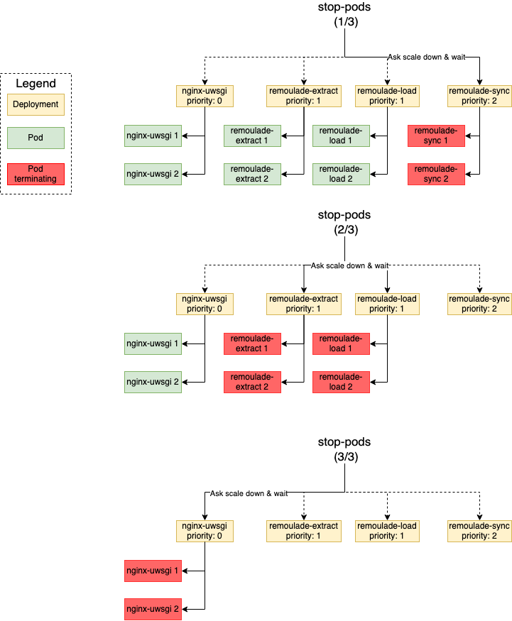

# Wiremind Kubernetes helper

This Python library is a high-level set of Kubernetes Helpers allowing either to manage individual standard Kubernetes controllers (Deployment, StatefulSets, etc)
or a logical set of standard Kubernetes controllers through the `expecteddeploymentscales.wiremind.io` CRD (for example allowing to scale down ALL Deployments of a Helm Release marked as such).

## Installation

This library requires the `expecteddeploymentscales.wiremind.io` CRD: `kubectl apply -f CustomResourceDefinition-expecteddeploymentscales.yaml`.

## Usage

See examples of usage in Wiremind [Chartreuse](https://github.com/wiremind/chartreuse) tool.

## stop-pods priorities

The `expecteddeploymentscales.wiremind.io` custom resource definition defines a `priority` field,
Allowing to control the priority of the Deployment under control for scale down order.

wiremind-kubernetes will, for each different priority found for all considered ExpectedDeploymentScale,
scale down all deployments with a given priority, then wait for their pods to be actually deleted,
then continue with the next priority (in descending order).

Higher priority means that the Deployment will be scaled down before others with lower priority.

`KubernetesDeploymentManager.stop_pods()` will use that definition.

In case of some Pods being slow to be deleted and others serving web server, this allows for less downtime for users (since we can state to delete first those slow-to-be-deleted pods, then stop the web server pods).

- The diagram has been drawn using the free online software https://draw.io, the
source code is located at `documentation/schema-stop-pods.png`, feel free
to correct it or make it more understandable.

## stop-pods with HPA

`KubernetesDeploymentManager.stop_pods()` neutralizes HPA managing the Deployments if any, as `HPAScaleToZero`
(see [here](https://github.com/kubernetes/kubernetes/pull/74526)) may be in use (HPA may scale up the Deployment even if its `replicas=0`),
a more straightforward solution will be available in the future see
[here](https://github.com/kubernetes/enhancements/pull/2022). Of course `KubernetesDeploymentManager.start_pods()` repairs it.
It is encouraged to run this to re-scale up.

See this [PR](https://github.com/wiremind/wiremind-kubernetes/commit/3990f00d1fff8b74b68e555321671be95b64b9b6) for more details.